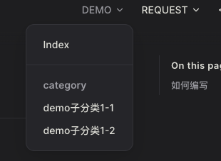
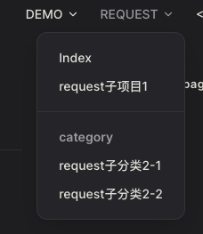

# Guide

## 如何编写
1. 在`docs`以下的几个目录中 添加 markdown 文件
    * /demo/
    * /request/

2. 在最外层 `soft@menu.js`中配置 nav 顶部子菜单和 sideBar 侧边菜单对应关系

<<< @/.vitepress/demo/menu.js

|                                                                 |                                                                    |
| --------------------------------------------------------------- | ------------------------------------------------------------------ |
|  |  |